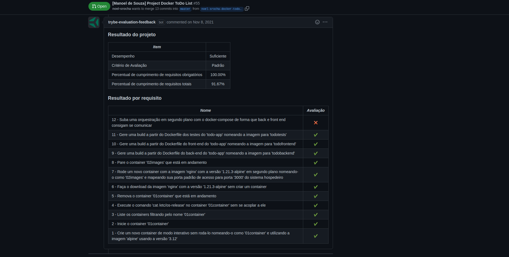

# Project Docker To-Do List

### The Assignment

You will "containerize" the frontend, backend and test applications, create a connection between them and orchestrate their functioning.

### Skills to be Tested

In this project, I was able to:
  * Use dockers commands in CLI - Command line interface;
  * Create a Docker container for a front-end application;
  * Create a Docker container for a backend application;
  * Create a Docker container for a test application;
  * Orchestrate the three containers using Docker compose.

### Evaluator Results

#### Disclaimer

This was an assignment developed by [Trybe](https://www.betrybe.com) in order to prove my skills using Docker.